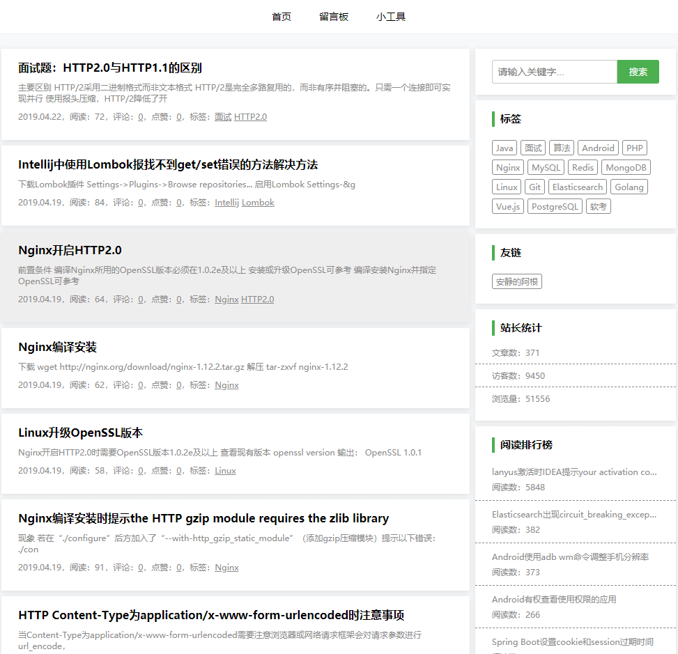

# Blog

记录开发中遇到的问题及知识点。

## 技术栈
- PHP/ThinkPHP开发；
- Nginx提供Web及静态资源服务；
- Redis缓存；
- MongoDB存储数据；
- Elasticsearch全文检索；
- Shell+cron监控服务；
- [Parsedown](https://github.com/erusev/parsedown "Parsedown")解析Markdown；
- [browscap](http://www.browscap.org)解析User-Agent；
- [淘宝IP地址库](http://ip.taobao.com "淘宝IP地址库")；
- [Vue.js后台管理页面](https://github.com/fendoudebb/z-blog-console "Vue.js后台管理页面")；

## 功能
- 文章评论、回复、点赞
- 全文检索
- 标签分类
- 友情链接
- 站长统计
- 阅读排行榜
- 点赞排行榜
- 评论排行榜
- 分享二维码
- 留言板及回复
- 格式化JSON
- 时间戳转换
- IP查询

## 网站展示

